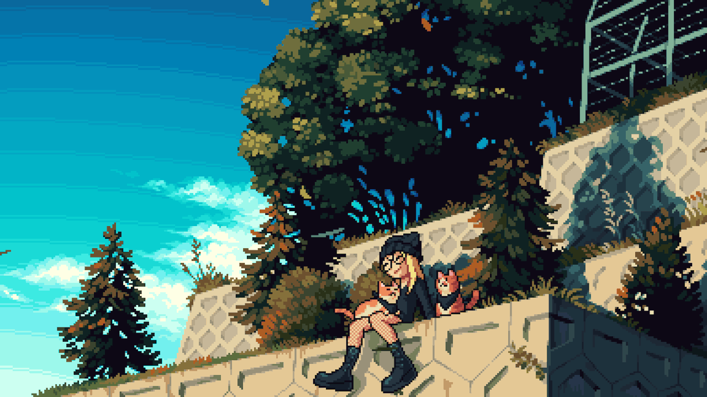

# Hi,this is Sally :P.

## I am a GAMER and Love Cafe time.

Life is not only an adventure, but also an ultimate exploration. Who am I and what is my mission And I found it. That is learning to understand the universe. Just like the opening animation of Github. In the vast sea of stars, I will definitely find my star, which will allow me to see a different universe.

Background GIF by [Carru Xd](https://jp.pinterest.com/pin/33988172183318873/) on [Pinterest](https://www.pinterest.com/), It's really Cool.

 &nbsp;
 &nbsp;

- 🌍  I'm based in Tokyo
- ✉️  You can contact me at [sherryuuer@gmail.com](mailto:sherryuuer@gmail.com)
- 🤝  I'm open to collaborating on interesting projects.
- 📝 I’m aiming to write **one article per week** starting from November 2023, you can check my blogs on my website.

## 💡 A Quote:

## 💻 My Tech Stack:

## 🏆 My Stats:

    &nbsp;&nbsp;
    &nbsp;&nbsp;

## 🎮 When I'm AFK:

 &nbsp;
 &nbsp;
 &nbsp;

