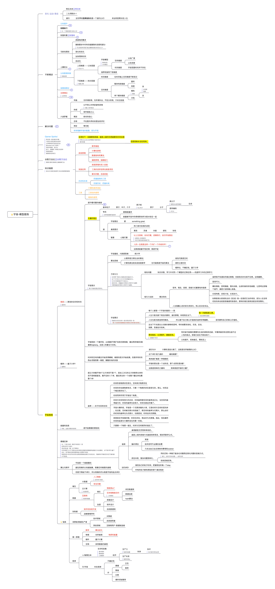

- [最后一天](最后一天.md)：一种向死而生的人生态度，会让每一天都闪闪发光。
- [问题解决者](问题解决者.md)：人生终归是一个解决问题的过程，只有解决问题的能力才是人的终极能力。
- [机器学习](机器学习.md)：机器学习的方法有时候需要拿来指导我们的实践。
- [强者思维](强者思维.md)：有些思维不是能和所有的人共享的，但是不代表它奇怪和不值得拥有，坚定很重要。
- [奥卡姆剃刀](奥卡姆剃刀.md)：简单的力量。
- [人性自检](人性自检.md)：时刻警醒自己所有的人性的弱点，不要屈服于所有的本能。
- [学习模型](学习模型.md)：人类认知的过程，就是学习的过程，学习是人类的本能。
- [工程思维](工程思维.md)：将每一件事都用工程思维去做，甚至将人生作为一个巨大的工程。
- [LifeSystem](lifesystem.md)：ZTM‘s Life System from Andrei。

