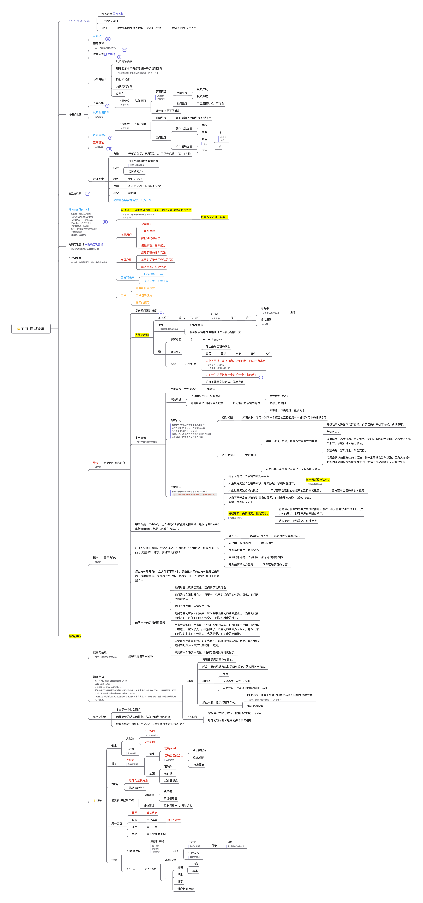

记录不定期的领域模型思考

## 经济模型和更上层的思考路径

经济模型的构建，首先从经济的根本基础来构建，就如同上次思考的结果一样。从基础开始。在此基础上开始生根发芽构建下一层。所有的案例都是为了强化这些主干知识。

更上层的思考路径是什么，大概率还是要回归到*基础科学领域*。

比如经济领域的*稀缺和效率*，计算机领域的*空间和时间*是根本原理的话，如果说*买和卖*是正反两面，*0和1*也是正反两面，那么在宇宙中的正反两面的东西是什么，基础学科中，比如数学，物理，化学，所有的东西都在走向一个趋势，那就是*对抗和均衡*，也许最后还是要回归*阴阳正反两面*，如何在这两面性中找到*趋势和规律*，看透这一切，可能才是最终的目的和走向。所有的表象都是*第一性根本原理*的无数表达和面貌，烦扰，美妙。

## 计算机和经济学模型联系和启发

数学模型是基础模型，数学的目的在于用工具高效解决问题，基础就是基础运算

计算机数据结构和算法，重要在于空间复杂度和时间复杂度

经济学领域同样有自己的数据结构和算法，对应于稀缺和效率两个关键词，同样是空间和时间复杂度的问题

针对计算机二进制计算0和1，经济学领域的就是一个买，一个卖而已

*人的天性* -> 对*稀缺*品的*需求*

*交易*就是经济中的基础计算：一个人（个人，企业，银行，政府）的支出是另一个人的收入

支出 = 货币 + 信用

无数的交易，组成了*市场*，市场就是一个基础计算元件，而市场又有非常多的种类，小麦，钢铁，汽车等等

无数的市场组成了*经济*的全貌：生产力的提高，短期债务周期，长期债务周期

*信贷*（债务）推进了支出，支出推动经济，良好的信用 = 更高的现金流，更多的可抵押物

更多的信贷和支出，让经济向上发展，但是还债的需要，导致了*短期债务周期*波动

长期的经济发展还是要靠生产率的提高！这个大波，会因全社会的债务问题导致经济危机，这就是大的*长期债务周期*

但是根本还是靠*生产力的提高*让整个经济向上，这就像是计算机科学的发展，还是靠算力等基础技术的发展

如果只靠生产力的提高，那么经济就是一条向上的直线，但是人的天性（提前消费），和信贷的运作规律，导致了经济的波动！

*人和人性*是这个世界中，不确定性的关键因素！

合理利用信贷，用于提高生产力，则是良性的，反之就是败家

为何会有还债波动，是因为整个社会的*生产力*，无法产出足够的商品满足需求，所以导致产量跟不上消费，导致*通过膨胀*

这时候就会出现政府干预，提高贷款利率，这时候就开始紧缩了，这就是短期债务周期，波动的机制

每一次短周期都会不断上升，形势一片大好，*人性*开始作用，以为经济大好，借贷愈演愈烈，泡沫经济导致了大经济危机！这就是大波

**人性让经济小波（用未来的资源换取现在想要的，提前消费）大波（误以为形势大好，上），最终还是要回归生产力水平**

**交易是经济中的基础计算，人性是不确定因子导致波动，但是也是有行为模型的，整个经济根本还是要靠生产力（就像计算机算力），每个经济领域都有自己的数据结构和算法**

**数学模型：线性回归，概率模型，博弈论等**

关于人性，小波动的主体是个人，大波动的主体则是政府和国家

国家的财富再分配如果不合理，就会导致社会动荡，经济是社会问题的根源

国家，是人的集合体，都是经济主体，规模不同罢了，企业也是

每一个经管领域，都是经济学基本原理的不同角度的模型

个体经验：1，第一要务永远是提高生产率，2，不要让收入超过生产率，3，不要让债务超过你的收入

早期思考图：

