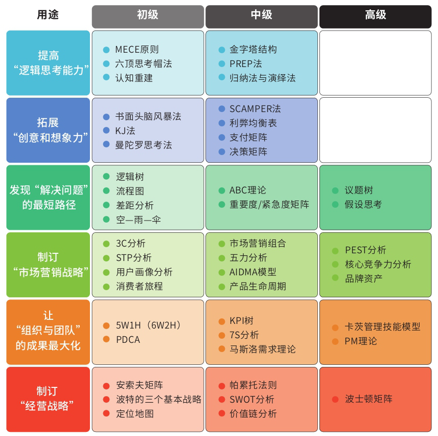

## 麦肯锡思考结构化战略思维

### 结构化战略思维的核心思想

- 这个世界是VUCA的：易变volatility，不确定uncertainty，复杂性complexity，模糊性ambiguity
- *发挥人类的优势*：**本能，敢于冒险，巧合事件，和犯错误**，和机器你比不过正确性和最佳答案的
- 目标：快速学习，融会贯通，自律和坚持，有边界感，方向感强，感染周围，不会焦虑
- **树立正确的问题观，面对问题，主动进攻！**
- **两种思维方式**：自下而上的专业思维，自上而下的结构化战略思维
  - 结构化战略思维，超越了专业，而是源于**超越具体技能的解决问题的能力**，说白了就是**普世的套路！**
  - 思考：我现在就是在做自下而上，这是一种线性学习，想要成为专家，但是局限了创造力和主导力，主要靠经验和专业知识，学习周期长，这个不代表不必要，但是有点片面

- **切**问题四种方法：
  - 公式法：使用经典的商业公式比如开源节流等工具找到要素，然后继续分解
  - 子目录列举法：将找到的要素按照子目录继续切
  - 流程法：根据事物的流程和生命周期进行分解
  - 逻辑框架法：内外，优劣，主客观等固定框架分析
- 将问题切分为**树状结构**
- 使用不同**维度**，针对维度的具体可衡量评判标准同样很重要，在这个阶段可以学习到专业的行业知识
- **MECE**原则为核心：子分类互相无重叠，子分类加起来穷尽全部可能

- **从单一思维到多维思考**
  - 项目优先级分析，相比怎么做，为什么做更重要
  - 使用象限工具，分析每个区域的项目内容
  - 利用数据分析工具，拓展业务分析维度
  - 思考：我觉得多维度的意义关键词：联系，关系，交叉分析，数据科学分析和决策

### 结构化战略思维四大原则

- **数字说话**
  - 数据只有和逻辑结合，才会产生真知灼见
  - 数据化是把一种现象转化成更高级的数字形式，以一种能被搜索、统计和分析的形式呈现
  - 注意，没有经过验证的数字都是骗人的，比如数字也主导了人们的很多购买行为，要辨别数字的可信度，数字维度分解，数字基数等因素
  - 注意异常值，特例，可能会大有启发！
  - 预测也会失效，预防黑天鹅

  - *数据科学家*能力

- **洞见优于表象**
  - 洞见是连接所有相关表象的筋络，是根本原因
  - 简单五步：寻找数据中的规律和趋势 / 分析异常值含义 / 对比参照数据 / 寻找相关信息 / 推演并提炼洞见
  - 洞见先行，然后再辅以论据或者分论点

  - 这个就很像*侦探*行为了

- **MECE原则**
  - 每个战略项目里，咨询师经常需要根据实际情况，利用维度切分和MECE原则创造出多个用于解决实际问题的全新理论框架，并以此为整个项目的逻辑主线。学习、创造并超越经典已经成了家常便饭！
  - 任何模型都是当时环境下的一个策略分析罢了比如下面这些，全都是问题很多的框架，并且有当时场景的局限性：
    - PEST模型：环境分析模型（政治，经济，社会，科学）
    - 波特五力模型：行业吸引力分析，针对制造业
    - 内部管理SWOT分析：一种很粗糙的分析
    - 麦肯锡7S模型：违背了MECE原则
    - BCG矩阵：产品分析矩阵，这个还是不错的，一个多维矩阵分析
    - 消费者感知图：客户分析框架
  - 学会用这个原则在生活中解决看似不可能的问题，是一种思考训练！

  - *模型发明者*

- **假设为前提**
  - 大胆假设，小心求证
  - 鼓励假设，对事不对人

  - 现在为止的真正的*科学家*们就是通过假设和求证，逼近真理的

### 麦肯锡五步法

- 定义问题 -> 结构化分析 -> 提出假设 -> 验证假设 -> 交付
- 这其实就是四个原则的后面两个原则的应用，而前面两部的数据和逻辑，则用于提出和验证假设上

- **定义问题**：专家思维只看问题怎么解决，战略思维会先问为什么做，从全局和需求角度考虑问题并重新定义问题，重新审视产品逻辑，也就是回归需求本位，人性本位
  - *如何衡量是否“定义了正确的问题”？*最直接的衡量标准就是，当这个正确的问题被解决后，相关的所有问题也会得到完全解决而没有后遗症。
  - 定义问题的框架：SMART（具体，可衡量，能落地，相关，时间性强）

- **结构化分析**：切和MECE，以及一些原则方法：
  - 小心逻辑陷阱
  - 归纳和演绎
  - 区分相关关系和因果关系

- **提出假设**：
  - 头脑风暴：差异，平等，发散

### 思考工具很必要

- 目的：提高分析的准确性，提高决策效率，有逻辑地表达
- 框架的三种类型：
  - 第一，对要素进行分解，比如把握现状，竞争对手分析，自我分析等
  - 第二，把握流程的框架，比如PDCA
  - 第三，进行对比的框架，比如进行重要性和紧急度的分析框架
- 思考框架只是思考的工具，在思考和实战中使用框架，将框架变成自己的东西至关重要

## 逻辑思考

## 创意思考

## 解决问题

## 市场营销

## 组织管理

## 经营战略
